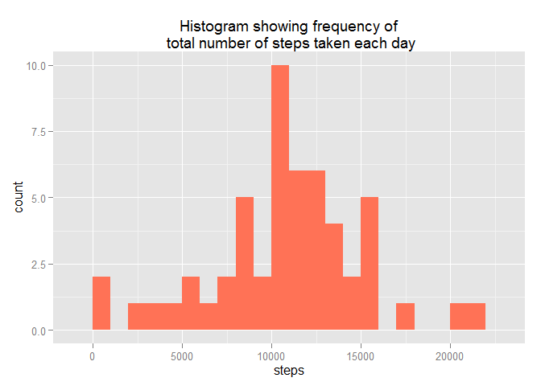
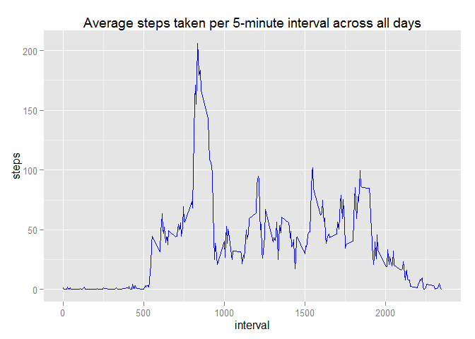
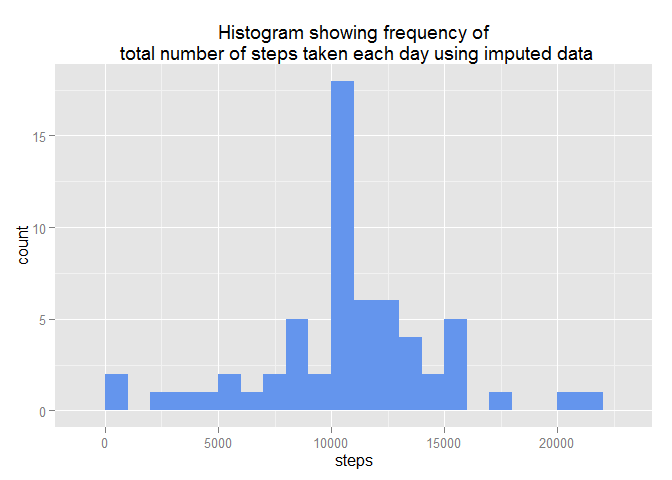

# Reproducible Research: Peer Assessment 1
## Setting global options
First, set echo=TRUE and warning=FALSE to turn off multiple warnings about certain packages being built under a newer R version (Example: "package 'ggplot2' was built under R version 3.1.2").  
Loading knitr to set opts_chunk.

```r
library(knitr)
```

```
## Warning: package 'knitr' was built under R version 3.1.2
```

```r
opts_chunk$set(echo=TRUE, warning=FALSE)
```

## Loading and preprocessing the data
####1. Load the data
Download the data from the URL provided by the assignment, unzip the file, and read it into `activity`.

```r
fileURL = "http://d396qusza40orc.cloudfront.net/repdata%2Fdata%2Factivity.zip"
download.file(fileURL, "activity.zip", mode="wb")
unzip("activity.zip")
activity <- read.csv("activity.csv", na.strings = "NA")
head(activity)
```

```
##   steps       date interval
## 1    NA 2012-10-01        0
## 2    NA 2012-10-01        5
## 3    NA 2012-10-01       10
## 4    NA 2012-10-01       15
## 5    NA 2012-10-01       20
## 6    NA 2012-10-01       25
```

```r
str(activity)
```

```
## 'data.frame':	17568 obs. of  3 variables:
##  $ steps   : int  NA NA NA NA NA NA NA NA NA NA ...
##  $ date    : Factor w/ 61 levels "2012-10-01","2012-10-02",..: 1 1 1 1 1 1 1 1 1 1 ...
##  $ interval: int  0 5 10 15 20 25 30 35 40 45 ...
```
####2. Process/transform the data (if necessary) into a format suitable for your analysis
Load the `lubridate` package to parse the date column into an understandable date format.

```r
library(lubridate)
activity$date <- parse_date_time(activity$date, "ymd")
str(activity)
```

```
## 'data.frame':	17568 obs. of  3 variables:
##  $ steps   : int  NA NA NA NA NA NA NA NA NA NA ...
##  $ date    : POSIXct, format: "2012-10-01" "2012-10-01" ...
##  $ interval: int  0 5 10 15 20 25 30 35 40 45 ...
```

## What is mean total number of steps taken per day?
####1. Make a histogram of the total number of steps taken each day.  
First, sum the number of steps per day from `activity` and aggregate it into `activityDaily`.

```r
activityDaily <- aggregate (steps~date, data=activity, FUN =sum)
head(activityDaily)
```

```
##         date steps
## 1 2012-10-02   126
## 2 2012-10-03 11352
## 3 2012-10-04 12116
## 4 2012-10-05 13294
## 5 2012-10-06 15420
## 6 2012-10-07 11015
```

```r
str(activityDaily)
```

```
## 'data.frame':	53 obs. of  2 variables:
##  $ date : POSIXct, format: "2012-10-02" "2012-10-03" ...
##  $ steps: int  126 11352 12116 13294 15420 11015 12811 9900 10304 17382 ...
```
Next, load `ggplot2` and create a histogram of the total number of steps taken each day.

```r
library(ggplot2)
ggplot(activityDaily, aes(x=steps, na.rm=T)) + geom_histogram(fill="coral1", binwidth=1000) + 
      ggtitle("Histogram showing frequency of\n total number of steps taken each day")
```

 

####2. Calculate and report the **mean** and **median** total number of steps taken per day  

```r
mean(activityDaily$steps, na.rm=T)
```

```
## [1] 10766.19
```

```r
median(activityDaily$steps, na.rm=T)
```

```
## [1] 10765
```


## What is the average daily activity pattern?
####1. Make a time series plot (i.e. `type = "l"`) of the 5-minute interval (x-axis) and the average number of steps taken, averaged across all days (y-axis)  
First, average the number of steps per interval from `activity` and aggregate it into `averageDaily`.

```r
averageDaily <- aggregate(steps~interval, data=activity, FUN=mean, na.rm=T)
```
Next, create a time series plot with 5-minute intervals on the x-axis and average number of steps taken across all days on the y-axis.


```r
ggplot(averageDaily, aes(x=interval, y=steps,)) + geom_line(color="blue") + 
      ggtitle("Average steps taken per 5-minute interval across all days")
```

 

####2. Which 5-minute interval, on average across all the days in the dataset, contains the maximum number of steps?

```r
averageDaily[which.max(averageDaily$steps),]
```

```
##     interval    steps
## 104      835 206.1698
```
Interval 835 has on average, the maximum number of steps at 206.1698 steps.

## Imputing missing values
####1. Calculate and report the total number of missing values in the dataset (i.e. the total number of rows with `NA`s)


```r
sum(is.na(activity))
```

```
## [1] 2304
```
There are 2304 missing values.

####2. Devise a strategy for filling in all of the missing values in the dataset. 
####3. Create a new dataset that is equal to the original dataset but with the missing data filled in.
These two requests are done simultaneously.  
**Strategy:** fill the missing values for each interval with the mean for that 5-minute interval.  
First, copy the existing dataset `activity` into a new dataset `imputed`.  
Then, if the value in `imputed$steps` is `NA`, then use the `lookup` function from library `qdap` to replace it with the average for that interval from `averageDaily`.

```r
imputed <- activity

library(qdap)
```

```
## Loading required package: qdapDictionaries
## Loading required package: qdapRegex
## Loading required package: qdapTools
## Loading required package: RColorBrewer
## 
## Attaching package: 'qdap'
## 
## The following object is masked from 'package:base':
## 
##     Filter
```

```r
for(i in 1:nrow(imputed)) {
      if (is.na(imputed$steps[i])) 
            imputed$steps[i] <- lookup(imputed$interval[i], averageDaily)
}
## Quick comparison of the original activity dataset and the new imputed dataset:
head(activity)
```

```
##   steps       date interval
## 1    NA 2012-10-01        0
## 2    NA 2012-10-01        5
## 3    NA 2012-10-01       10
## 4    NA 2012-10-01       15
## 5    NA 2012-10-01       20
## 6    NA 2012-10-01       25
```

```r
head(imputed)
```

```
##       steps       date interval
## 1 1.7169811 2012-10-01        0
## 2 0.3396226 2012-10-01        5
## 3 0.1320755 2012-10-01       10
## 4 0.1509434 2012-10-01       15
## 5 0.0754717 2012-10-01       20
## 6 2.0943396 2012-10-01       25
```

```r
str(imputed)
```

```
## 'data.frame':	17568 obs. of  3 variables:
##  $ steps   : num  1.717 0.3396 0.1321 0.1509 0.0755 ...
##  $ date    : POSIXct, format: "2012-10-01" "2012-10-01" ...
##  $ interval: int  0 5 10 15 20 25 30 35 40 45 ...
```
####4. Make a histogram of the total number of steps taken each day and Calculate and report the **mean** and **median** total number of steps taken per day. 
First, sum the number of steps per day from `imputed` and aggregate it into `imputedDaily`.

```r
imputedDaily <- aggregate (steps~date, data=imputed, FUN =sum)
head(imputedDaily)
```

```
##         date    steps
## 1 2012-10-01 10766.19
## 2 2012-10-02   126.00
## 3 2012-10-03 11352.00
## 4 2012-10-04 12116.00
## 5 2012-10-05 13294.00
## 6 2012-10-06 15420.00
```

```r
str(imputedDaily)
```

```
## 'data.frame':	61 obs. of  2 variables:
##  $ date : POSIXct, format: "2012-10-01" "2012-10-02" ...
##  $ steps: num  10766 126 11352 12116 13294 ...
```

Next, create a histogram of the total number of steps taken each day.

```r
ggplot(imputedDaily, aes(x=steps)) + geom_histogram(fill="cornflowerblue", binwidth=1000) + 
      ggtitle("Histogram showing frequency of\n total number of steps taken each day using imputed data")
```

 

Then, calculate the mean and median.

```r
mean(imputedDaily$steps)
```

```
## [1] 10766.19
```

```r
median(imputedDaily$steps)
```

```
## [1] 10766.19
```
####Do these values differ from the estimates from the first part of the assignment?   
No, these values do not differ much from the estimates from the first part of the assignment.  

####What is the impact of imputing missing data on the estimates of the total daily number of steps?  
There is little impact on the mean and median of the overall dataset by imputing missing data.

## Are there differences in activity patterns between weekdays and weekends?
####1. Create a new factor variable in the dataset with two levels -- "weekday" and "weekend" indicating whether a given date is a weekday or weekend day.
Using an ifelse statement, if it's Saturday or Sunday, call it a weekend.  Else, call it a weekday.

```r
imputed$weekday <- as.factor(ifelse(weekdays(imputed$date) %in% c("Saturday", "Sunday"), "weekend", "weekday"))
head(imputed)
```

```
##       steps       date interval weekday
## 1 1.7169811 2012-10-01        0 weekday
## 2 0.3396226 2012-10-01        5 weekday
## 3 0.1320755 2012-10-01       10 weekday
## 4 0.1509434 2012-10-01       15 weekday
## 5 0.0754717 2012-10-01       20 weekday
## 6 2.0943396 2012-10-01       25 weekday
```

```r
str(imputed)
```

```
## 'data.frame':	17568 obs. of  4 variables:
##  $ steps   : num  1.717 0.3396 0.1321 0.1509 0.0755 ...
##  $ date    : POSIXct, format: "2012-10-01" "2012-10-01" ...
##  $ interval: int  0 5 10 15 20 25 30 35 40 45 ...
##  $ weekday : Factor w/ 2 levels "weekday","weekend": 1 1 1 1 1 1 1 1 1 1 ...
```
####2. Make a panel plot containing a time series plot of the 5-minute interval (x-axis) and the average number of steps taken, averaged across all weekday days or weekend days (y-axis).
First, average the number of steps per interval from `imputed` and aggregate it into `averageImputed`.

```r
averageImputed <- aggregate (steps~interval+weekday, data=imputed, FUN=mean)
head(averageImputed)
```

```
##   interval weekday      steps
## 1        0 weekday 2.25115304
## 2        5 weekday 0.44528302
## 3       10 weekday 0.17316562
## 4       15 weekday 0.19790356
## 5       20 weekday 0.09895178
## 6       25 weekday 1.59035639
```

```r
str(averageImputed)
```

```
## 'data.frame':	576 obs. of  3 variables:
##  $ interval: int  0 5 10 15 20 25 30 35 40 45 ...
##  $ weekday : Factor w/ 2 levels "weekday","weekend": 1 1 1 1 1 1 1 1 1 1 ...
##  $ steps   : num  2.251 0.445 0.173 0.198 0.099 ...
```

Then, use `lattice` to plot the panel graph.

```r
library(lattice)
xyplot(steps ~ interval | weekday, data = averageImputed, layout = c(1,2), type="l")
```

 
